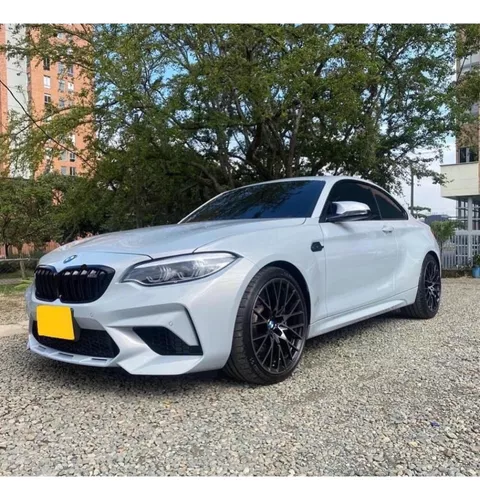
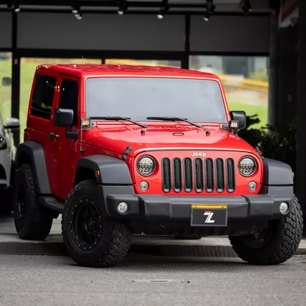

# Sena-IITIC-7
<!DOCTYPE html>
<html lang="es">
<head>
    <meta charset="UTF-8">
    <meta name="viewport" content="width=device-width, initial-scale=1.0">
    <link rel="stylesheet" href="https://stackpath.bootstrapcdn.com/bootstrap/4.3.1/css/bootstrap.min.css" integrity="sha384-ggOyR0iXCbMQv3Xipma34MD+dH/1fQ784/j6cY/iJTQUOhcWr7x9JvoRxT2MZw1T" crossorigin="anonymous">
    <link rel="stylesheet" href="styles1.css">
    <title>AutoCali Compraventa</title>
</head>
<body>

    <header>
        

            

                
                <h1>AutoCali Compraventa</h1>
            

            <nav class="navbar navbar-expand-lg navbar-light bg-light">
                <button class="navbar-toggler" type="button" data-toggle="collapse" data-target="#navbarNav" aria-controls="navbarNav" aria-expanded="false" aria-label="Toggle navigation">
                    
                </button>
                

                    <ul class="navbar-nav ml-auto">
                        <li class="nav-item active">
                            <a class="nav-link" href="#presentation">Presentación</a>
                        </li>
                        <li class="nav-item">
                            <a class="nav-link" href="#mission-vision">Misión y Visión</a>
                        </li>
                        <li class="nav-item">
                            <a class="nav-link" href="#services-contact">Servicios y Contacto</a>
                        </li>
                        <li class="nav-item">
                            <a class="nav-link" href="#gallery">Galería</a>
                        </li>
                        <li class="nav-item">
                            <a class="nav-link" href="#video">Video</a>
                        </li>
                    </ul>
                

            </nav>
        

    </header>

    <section id="presentation" class="section presentation">
        

            

                

                    <h2 class="card-title">Nuestra Presentación</h2>
                    
¡Bienvenidos a AutoCali Compraventa, la mejor opción para la compra y venta de vehículos en Cali, Colombia!

                

            

        

    </section>

    <section id="mission-vision" class="section mission-vision">
        

            

                

                    <h2 class="card-title">Nuestra Misión y Visión</h2>
                    
<strong>Misión:</strong> En AutoCali Compraventa, nuestra misión es facilitar el proceso de compra y venta de vehículos en Cali, Colombia, proporcionando a nuestros clientes una experiencia transparente, segura y eficiente. Nos comprometemos a ofrecer soluciones que se adapten a las necesidades individuales de cada cliente, brindando confianza y satisfacción en cada transacción.

                    
<strong>Visión:</strong> Como líderes en el mercado de compraventa de vehículos en Cali, aspiramos a ser reconocidos por nuestra integridad, profesionalismo y servicio al cliente excepcional. Buscamos ser la primera opción para aquellos que buscan vender o adquirir un vehículo, estableciendo relaciones duraderas basadas en la confianza y la transparencia.

                

            

        

    </section>

    <section id="gallery" class="section gallery">
        

            <h2 class="text-center">Nuestra Galería de Fotos</h2>
            

                

                    

                        

                            

                                
                            

                            

                                
                            

                            

                                
                            

                            

                                
                            

                        

                        <a class="carousel-control-prev" href="#imageCarousel" role="button" data-slide="prev">
                            
                            Anterior
                        </a>
                        <a class="carousel-control-next" href="#imageCarousel" role="button" data-slide="next">
                            
                            Siguiente
                        </a>
                    

                

            

        

    </section>

    <section id="video" class="section video">
        

            

                

                    

                        <iframe width="560" height="315" src="https://www.youtube.com/embed/VIDEO_ID" frameborder="0" allowfullscreen></iframe>
                    

                

            

        

    </section>

    <footer class="footer">
        

            

                

                    <h3>Contacto</h3>
                    
Les invitamos a visitar nuestro concesionario en [Dirección], donde nuestro amable equipo estará encantado de ayudarles a encontrar el vehículo perfecto. También pueden ponerse en contacto con nosotros a través de:

                    
<strong>Teléfono:</strong> [Número de teléfono]

                    
<strong>Correo Electrónico:</strong> <a href="mailto:info@autocali.com.co">info@autocali.com.co</a>

                

            

        

    </footer>

    
    
    
    

</body>
</html>
